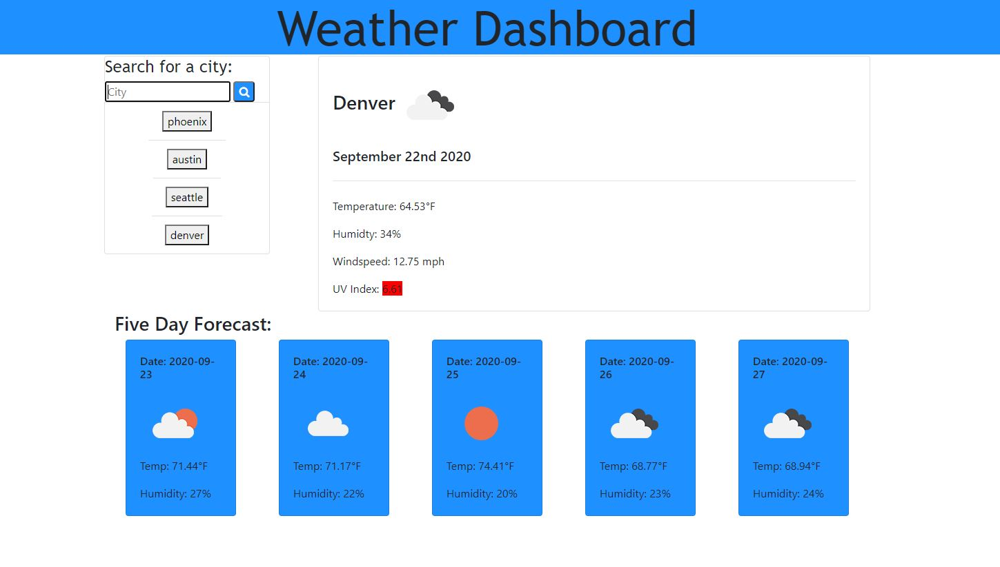

# Weather Dashboard App
This is a searchable weather dashboard that gives current and future weather parameters for multiple cities.

# Features:
Shows the temperature, humidity, wind speed, and UV index for the current day.  Also gives a 5 day forecast that includes the temperature and humidity for the following 5 days at 3:00pm for each day.

# App in action:

# Links to Github and live app:
https://github.com/Jdilla1212/Weather-Dashboard
https://jdilla1212.github.io/Weather-Dashboard/

# Languages used:
HTMl
CSS
Javascript
Jquery

# I can be contacted at:
Email; jdp237@nau.edu
LinkedIn: www.linkedin.com/in/joshua-padilla-4052371ab

